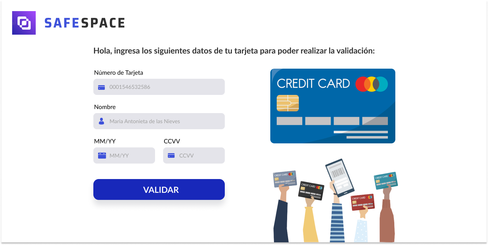

# Card Security

Es una pagina web que busca validar el numero de tarjeta de crédito de cada usuario de distintos bancos para realizar algún proceso interno en el banco como:
* Realizar un pago
* Consultar un préstamo aprobado

**Investigación UX:** 
Los usuarios son personas de (18-65) años, el cual poseen una tarjeta ya sea de debito para mantener una cuenta de ahorros o sueldoo; o tambien tarjeta de crédito que fueron seleccionados por el banco para contar con su producto.

*Explicar quiénes son los usuarios y los objetivos en relación con el producto*

Todos nuestros usuarios finales son mayores de edad que cuentan con una tarjeta de débito/crédito el cual busca brindar al usuario la seguridad de que sus datos confidenciales se encuentran  seguros ante cualquier inconveniente cibernetico, en el proceso de la validación del número de tarjeta, para ello se desarrollo un espacio confiable e intuitivo.

*Explicar cómo el producto soluciona los problemas/necesidades de dichos usuarios.*

Esta página ayuda al usuario a validar su tarjeta de crédito para que pueda realizar alguna compra on-line.

*Luego colocarás la foto de tu primer prototipo en papel.*

*Agregar un resumen del feedback recibido indicando las mejoras a realizar.*

*Imagen del prototipo final.*

